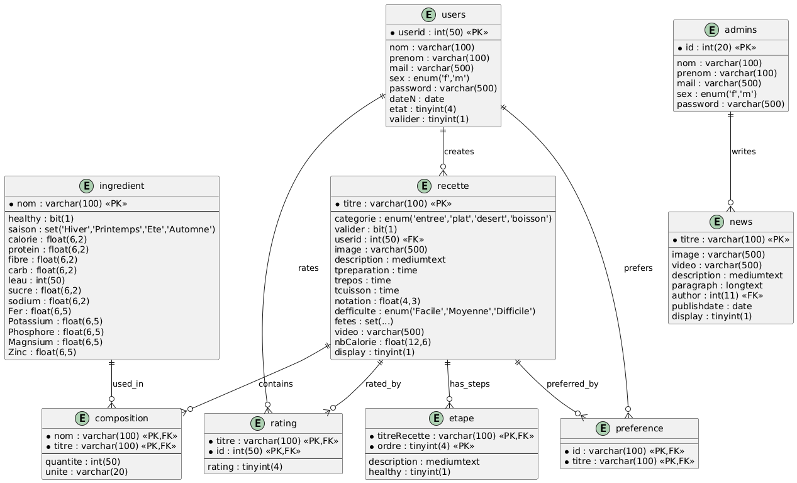

# Algerian-Traditional-Foods-Database
A small Algerian database for some of the local traditional dishes, sweets, starters and drinks specificly from Blida.
the database is intended for web apps featuring traditional Algerian foods with there ingredients, ratings, steps, nutritional value .

## Tables
**recette**
- the column ddescription refers to the short description that appears on the dish cart.
- tpreparation is the time for preparation
- trepos is the resting time for some dishes
- tcuisson is the cooking time
- fetes refers to the common holidays in Algeria
  
**ingredient**
- refers to the ingredients used in the dish it contains nutritional informations as well as the season and whether the dish is healthy or not .
  
**composition**
- the table that links the dish to the ingredient while adding an extra information about the quantity used and the unit of measurement (i used grams and liters in the database).
  
the rest of the tables are used for tasks related to websites such as administration,liking a recipie , user management . the administrator can add news in the website.

- Note the images and videos are stored as links .

